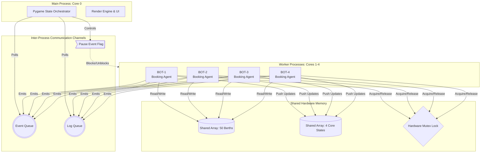
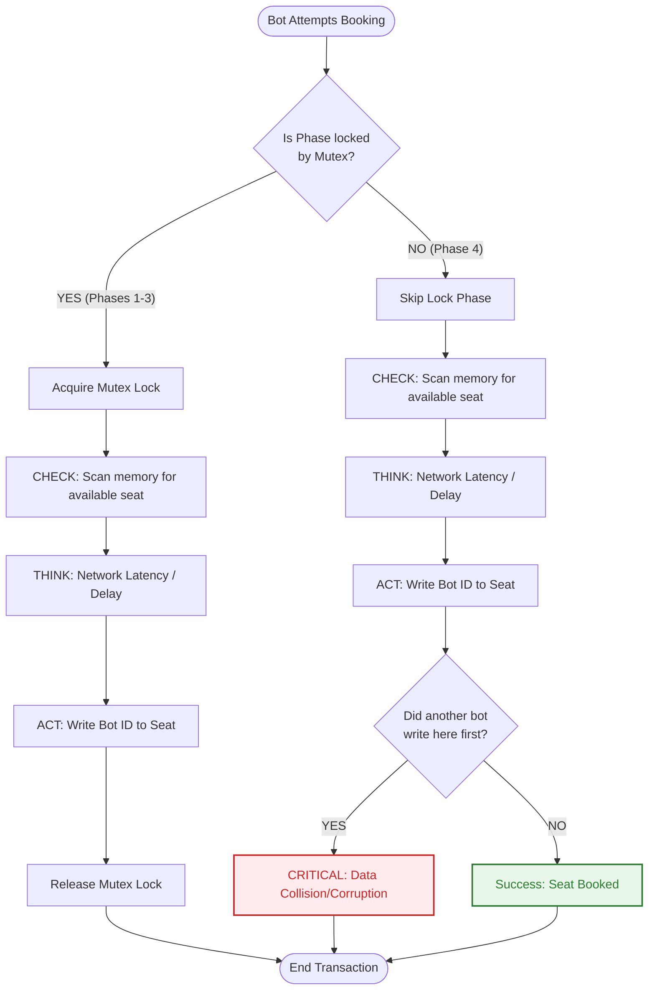

# 🚂 Multi-Core Railway Reservation Simulator — X-Ray Logic Edition


A high-fidelity academic hardware concurrency simulator demonstrating **Symmetric Multiprocessing (SMP)**, **Hardware Mutual Exclusion (Mutex) Locks**, **Race Conditions**, and **Amdahl's Law**. 

The simulator specifically bypasses Python's Global Interpreter Lock (GIL) by leveraging the OS-level `multiprocessing` library to spawn physical, parallel computation threads, visually simulating real-world concurrency challenges in a heavily transactional booking database.

---

## 📑 Table of Contents
- [Core Features](#-core-features)
- [System Architecture](#-system-architecture)
- [X-Ray Logic: Check-then-Act Flow](#-x-ray-logic-check-then-act-flow)
- [Simulation Phases](#-simulation-phases)
- [Installation & Usage](#-installation--usage)
- [Visual Simulators](#-visual-simulators-html)

---

## 🎯 Core Features

- **True Parallel Execution**: Uses Python's `multiprocessing` (not `threading`) to utilize multiple physical CPU cores.
- **X-Ray "Check-then-Act" Visuals**: Clearly demonstrates the gap between reading data and writing data. UI pulses yellow during the "thinking" (network latency) window.
- **Race Condition "Chaos Mode"**: Shows what happens when the Mutex lock is disabled and multiple threads attempt to write to the same memory segment simultaneously (resulting in data corruption).
- **Amdahl's Law Telemetry Graph**: Generates real-time comparisons of expected vs. theoretical maximum concurrency throughput when scaling up processor counts.
- **Presenter Control Mode**: 50% Grayscale "Silent Pause" (`[P]`) for academic and structural explanation before resuming threads.
- **3rd-AC LHB Bogie Geometry**: Architecturally accurate 50-berth rendering (UB, MB, LB, SL, SU) with parallax scrolling terrain elements.

---

## ⚙️ System Architecture

The simulation employs a highly decoupled **Producer-Consumer** architecture using OS-level Inter-Process Communication (IPC) and Shared Memory segments to orchestrate data between the UI process and the background computational bots.



> [!TIP]
> **Why `multiprocessing` over `threading`?**
> Due to Python's Global Interpreter Lock (GIL), the standard `threading` library can only achieve *concurrency* (rapidly switching between threads on a single core). To achieve *true hardware parallelism* (multiple CPU cores executing simultaneously), this project drops down to the OS-level `multiprocessing` standard library.

---

## 🔍 X-Ray Logic: Check-then-Act Flow

The most critical element of the simulator is visualizing a standard transaction vulnerability. In high-performance backend databases, reading a record ("Check") and writing to a record ("Act") are separate atomic CPU instructions. 

This flow chart demonstrates how the presence or absence of a **Mutex Lock** radically alters system integrity.



---

## 🚦 Simulation Phases

The presentation cycles sequentially through standard concurrency states to scientifically demonstrate performance ceilings and security flaws.

| Phase | Configuration | Description | Outcome |
| :---: | :--- | :--- | :--- |
| **Phase 1** | `1 Core` <br> `Mutex: YES` | **Serial Baseline**: A single bot runs standard sequential bookings. | Establishes base Time ($T_1$). 100% integrity. |
| **Phase 2** | `2 Cores` <br> `Mutex: YES` | **Parallel Mutex**: Workload is split. The mutex correctly serializes the critical database writing section. | Moderate speedup. 100% integrity. |
| **Phase 3** | `4 Cores` <br> `Mutex: YES` | **Max Parallelism**: Maximize thread limit. Demonstrates a saturated mutex waiting queue. | Bottlenecking begins due to Amdahl's Law constraints. |
| **Phase 4** | `4 Cores` <br> `Mutex: NO` | **Chaos (Race Conditions)**: Mutex is completely disabled. All bots scan and fire simultaneously at target memory addresses. | Massive data corruption (Red Cells). High throughput but complete integrity failure. |

> [!WARNING]
> During **Phase 4**, multiple bots are highly likely to scan the same empty seat, sleep, and then inject their Booking ID simultaneously. The Pygame UI will display `CHECK×N` in orange during the sleep cycle, followed by a red `CORRUPT` tag.

---

## 💻 Installation & Usage

### 1. Prerequisites
Ensure you have Python 3.8 or higher installed on your machine.

### 2. Install Dependencies
You will need to install `pygame` for the rendering engine.
```bash
pip install pygame
```

### 3. Run the Simulator
```bash
python railway_simulator.py
```

### 4. Presenter Controls
Control the flow of the simulator using your keyboard:
- `[SPACE]` : Manually step forward into the next Phase.
- `[P]` : **Silent Pause Mode** / Grayscale view for instructor lecturing.
- `[R]` : Reset the current phase and start over.
- `[S]` : Toggle Slow-Motion mode (doubles network latency parameters for better visibility).
- **Mouse Click** : You (the STUDENT) can attempt to book a seat manually while the simulation is running to fight the automated bots!

---

## 📊 Visual Simulators (HTML)

The repository also includes two lightweight visual simulators built in vanilla `HTML`/`CSS`/`JS` for quick web-based demonstration of concurrency models:

1. **`parallel_simulator.html`**: Demonstrates **Domain Decomposition** – Visually splitting 128 task boundaries flawlessly across $N$ chosen cores.
2. **`smp_simulator.html`**: A cyberpunk-themed dashboard visualizing ping-packet **Race Conditions** and Mutex hardware gate bottlenecks.

*(Note: These files are purely for presentation visualization and not mechanically executing OS threads like the primary Python implementation).*
